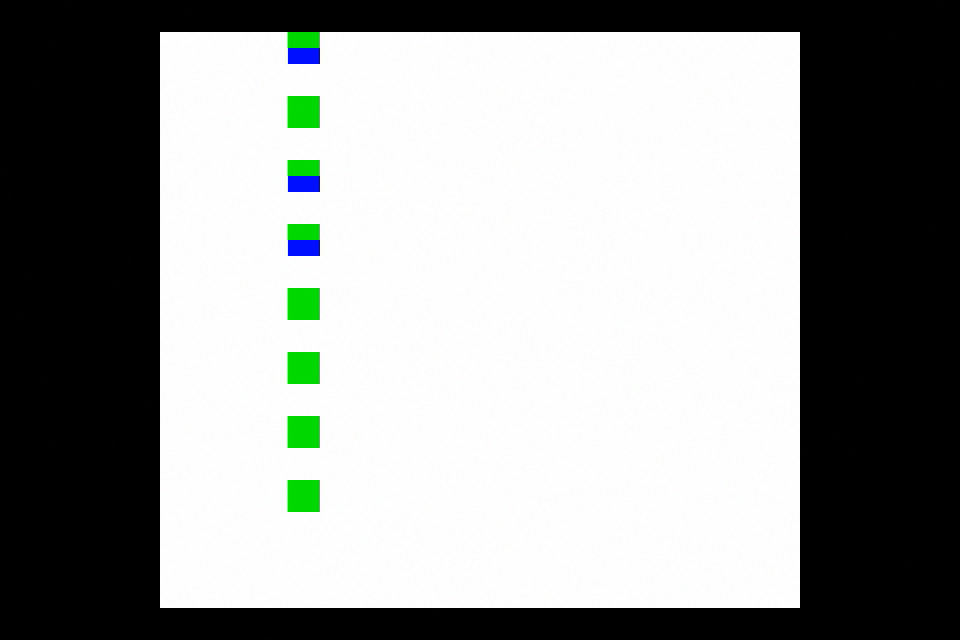

# MagenTests

Collection of test roms to check and verify the behavior of the Gameboy Color during the development of my emulator - [MagenBoy](https://github.com/alloncm/MagenBoy)

## ColorBgOamPriority

The gameboy color has 3 different places where the priority between the Background layer and the OAM a layer can be declared.

This test verifies the reltions between those flags and the behavior when they colide.

Checkout the [PanDocs](https://gbdev.io/pandocs/Tile_Maps.html#bg-to-obj-priority-in-cgb-mode) for background on the CGB behavior.

### Test result

You should see 5 green squares and 3 half grren and half blue squares with no red lines

#### Expected results:

Screnshoot from Orignal CGB hardware

#### Original hardware

Special thanks to [ISSOtm](https://github.com/ISSOtm) for running this test rom on original hardware, verifying it actually works and screenshoting the result.

## ColorOamInternalPriority

The gameboy color changes the way the PPU manages its internal OAM objects priority.

For more info checks the [PanDocs](https://gbdev.io/pandocs/OAM.html#drawing-priority).

### Test result

You should see 2 pairs of rectangles connected or touching each other.

#### Expected result

## Vram DMA HBlank mode

This peripheral was added in the GameBoy Color and the HBlank mode turns out to be a bit tricky.

For more info check the [PanDocs](https://gbdev.io/pandocs/CGB_Registers.html#lcd-vram-dma-transfers).

One undocumented detail I found is that the HDMA HBlank should be halted when the CPU is halted.

### Test result

The screen should be all green!

Errors 
- Red screen - HDMA HBlank operation have been executed succesfully 
- Blue screen - HDMA HBlank operation have been executed even tought the CPU is halted

#### Expected result

## KEY0 (CPU mode register) Lock After Boot

This register is CGB only and controls the mode of the system, mainly for compatibality with old DMG carts.

This register is being writen by the bootrom and get locked after 0xFF50 is written to.

For more info check [this link](https://forums.nesdev.org/viewtopic.php?p=248353&sid=693346db893528869f0907b1d5008897#p248353)

### Test result

The screen should be all green!

#### Expected result

